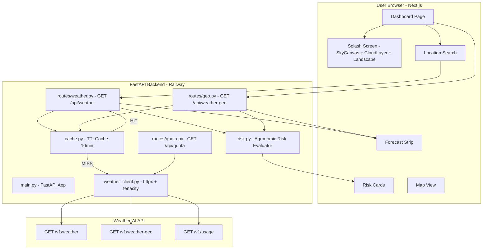
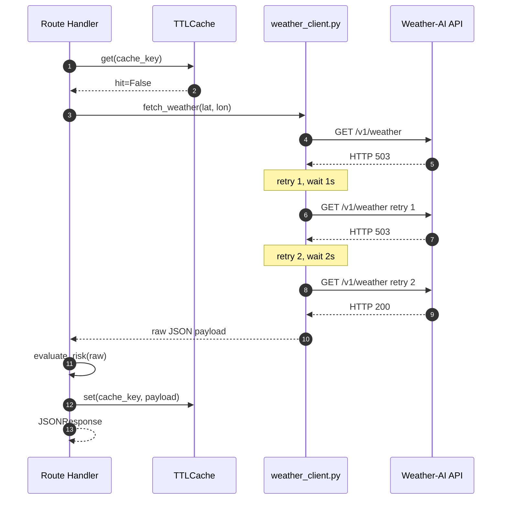
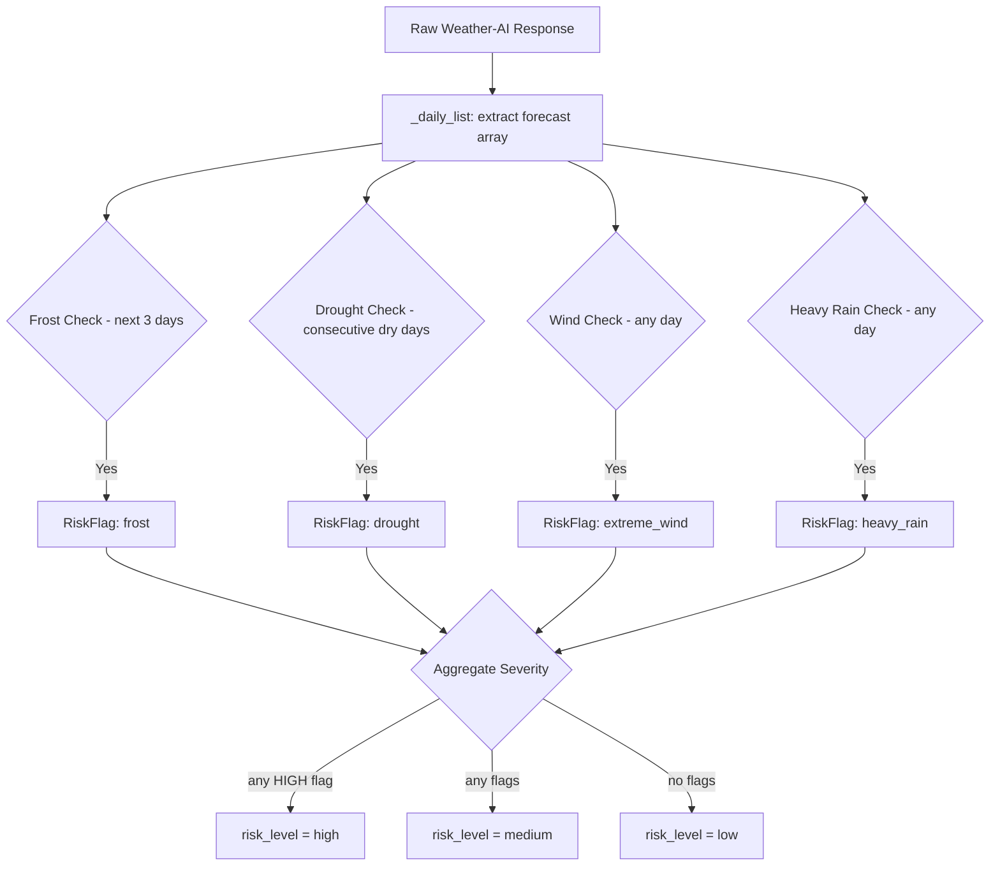
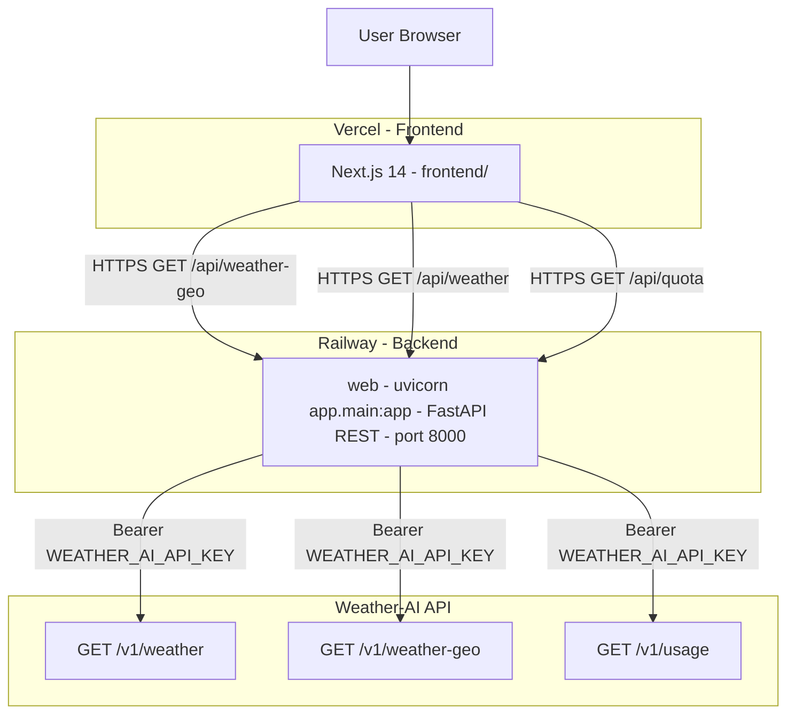

<p align="center">
  <strong>Real-time agronomic weather risk intelligence.</strong>
</p>

<p align="center">
  <a href="https://weather.joshuatochinwachi.online"></a>
  <a href="./backend/app/main.py"></a>
  <a href="./backend/.env.example"></a>
</p>

<p align="center">
  
  
  
  
  
  
  
</p>

---

> **Weather Risk Advisory** is a full-stack agronomic intelligence platform purpose-built for smallholder farmers in Nairobi, Bomet, Mombasa, and the wider East African region. It proxies real-time weather data through a Python backend, applies a transparent agronomic risk engine across four threshold dimensions (frost, drought, extreme wind, heavy rain), and renders the full risk picture in a cinematic Next.js dashboard — complete with a 5-second animated splash screen that mirrors the actual data loading lifecycle.

---

## Table of Contents

- [Grand System Architecture](#grand-system-architecture)
- [Feature Highlights](#feature-highlights)
- [Cinematic Splash Screen — Sky Cycle](#cinematic-splash-screen--sky-cycle)
- [Backend — Python Agent](#backend--python-agent)
  - [Weather Client and Retry Engine](#1-weather-client--retry-engine)
  - [Agronomic Risk Engine](#2-agronomic-risk-engine)
  - [In-Memory TTL Cache](#3-in-memory-ttl-cache)
  - [FastAPI REST Gateway](#4-fastapi-rest-gateway)
  - [IP Geolocation Auto-Detect](#5-ip-geolocation-auto-detect)
- [Frontend — Next.js Dashboard](#frontend--nextjs-dashboard)
  - [Dashboard Page](#1-dashboard-page)
  - [Splash Screen Components](#2-splash-screen-components)
- [Risk Model Reference](#risk-model-reference)
- [Project Structure](#project-structure--module-mapping)
- [Complete Tech Stack](#complete-tech-stack)
- [Deployment Topology](#deployment-topology)
- [Environment Variables](#environment-variables-reference)
- [Setup and Running Locally](#setup--running-locally)
- [Test Suite](#test-suite)
- [Roadmap](#roadmap)

---

## Grand System Architecture

Weather Risk Advisory is a fully decoupled, service-oriented system. Data flows from the user browser through a Next.js frontend to a FastAPI Python proxy which calls the Weather-AI API, applies the agronomic risk model, caches the result, and returns a typed JSON response.



---

## Feature Highlights

| Feature | Description |
|---|---|
| **Real-Time Weather + AI Summary** | Fetches live 7-day forecast, current conditions, and hourly data from Weather-AI. The AI-generated Gemini summary is surfaced directly in the dashboard. |
| **Agronomic Risk Engine** | Four-dimensional risk model evaluates frost, drought, extreme wind, and heavy rain against scientifically calibrated thresholds. Returns `low` / `medium` / `high` with per-flag detail text. |
| **IP Auto-Geolocation** | On first load, the backend resolves the user's client IP to detect location automatically via `/api/weather-geo`. Fallback to Nairobi for local development. |
| **Manual Location Search** | Users can search any global location by name. The frontend geocodes the search to lat/lon and calls `/api/weather`. |
| **10-Minute In-Memory Cache** | Thread-safe TTL cache prevents redundant calls to Weather-AI. Cache keys are rounded to 2 decimal places, eliminating noise-level cache misses. |
| **Retry on Server Errors** | `tenacity` retries up to 3 times on HTTP 500/503 with exponential backoff (1s → 2s → 4s). 4xx errors are never retried. |
| **Typed Error Surfaces** | `AuthError`, `RateLimitError`, `PlanGatingError`, `ServerError` are typed exceptions mapped to correct HTTP status codes. The client always receives structured JSON, never a traceback. |
| **Quota Display** | Live API usage meter (`used / limit / remaining`) shown in the footer. |
| **Sky Cycle Splash Screen** | A 5-second, physics-driven animated splash screen with canvas rain particles, SVG cloud gathering, a nature landscape, a mono status ticker, and a gradient progress bar — tied to the real API loading lifecycle. |
| **Interactive Map** | Leaflet map renders the resolved location on load and updates with search results. |
| **7-Day Forecast Strip** | Horizontal scrollable strip with per-day icons, temp ranges, precipitation, and wind. |
| **Fully Responsive** | Dashboard, splash screen, and all components are optimized for mobile through 4K desktop. |
| **API Key Never Exposed** | The Weather-AI API key is exclusively server-side. The frontend only calls the Railway backend. |

---

## Cinematic Splash Screen — Sky Cycle

The splash screen is not decorative — it is a **physically coherent sky scene** that progresses through weather states as a metaphor for what the application is actually doing: connecting, fetching, analyzing, revealing.

### Design Concept

Not a reel of random weather icons. One continuous sky arc — from deep navy dawn, through gathering storm clouds, through rain, into clearing — mapped to the exact lifecycle of the API request. The animation phases are driven by real `isDataReady` state, not a fake timer.

### Color Tokens

| Token | Value | Usage |
|---|---|---|
| `sky-dawn` | `#0B1224` | Base background — matches the app's existing dark-navy brand |
| `sky-storm` | `#1E3A5F` | Mid-phase sky during cloud gathering |
| `sun-core` | `#FFB74D` | Sun glow center |
| `sun-edge` | `#FF8A3D` | Sun glow falloff |
| `rain-streak` | `#8FB8FF` | Rain particle color (low opacity) |
| `rain-highlight` | `#C7DBFF` | Rain particle catch-light |
| `clear-accent` | `#7C5CFC → #4F6EF7 → #34D399` | Clearing-sky gradient sweep + progress bar fill |
| `text-primary` | `#F5F7FA` | Wordmark |

**Typography:**
- Wordmark: **Space Grotesk** — geometric, technical, distinct from generic AI-default serifs.
- Status ticker: **JetBrains Mono** — sets the status text apart as system terminal output, not marketing copy.

### Animation Phase Timeline

| Phase | Trigger | Visual | Duration |
|---|---|---|---|
| **1 — Dawn** | Component mount | Deep navy sky, faint sun glow begins at screen bottom, stars dissolve | Min 500ms |
| **2 — Gathering** | API call in flight | 3 SVG cloud ellipses drift inward from screen edges, sky shifts toward `sky-storm` | Actual fetch duration, min 600ms |
| **3 — Rain** | Data received, risk engine running | Canvas rain particles begin, sun dims behind clouds, progress bar fills to ~85% | 400–800ms |
| **4 — Clearing** | Risk response ready | Rain eases off, clouds part, `clear-accent` gradient sweeps across sky, sun brightens | Fixed 500ms |
| **5 — Reveal** | Clearing complete | Entire canvas fades out (300ms), dashboard fades in via crossfade — no hard cut | 300ms |

**Timing guardrails:**
- Minimum total splash: **1.2s** — prevents jarring flash on warm cache hits
- User-configured display: **5s** — extended to give users a full view of the nature animation
- Maximum splash: **4s** — backend timeout guard; never traps users behind slow networks

### Component Architecture

```
components/
└── SplashScreen/
    ├── SplashScreen.tsx     # Phase state machine orchestrator, progress bar, fade logic
    ├── SkyCanvas.tsx        # HTML5 canvas: rain particles + water splash ripples
    ├── CloudLayer.tsx       # SVG cloud shapes with CSS phase-driven drift animations
    ├── Landscape.tsx        # Nature silhouette: layered SVG hills + acacia trees + crop sprigs
    ├── StatusTicker.tsx     # JetBrains Mono status text, phase-synced (terminal style)
    └── useSplashPhase.ts   # Hook: phase state machine + real fetch-lifecycle wiring
```

### useSplashPhase — Real Loading, Not a Fake Timer

```typescript
// Phases map 1:1 to real backend events — not fixed durations
type Phase = 'dawn' | 'gathering' | 'rain' | 'clearing' | 'done';

// dawn      → triggered on mount
// gathering → triggered when the API call begins
// rain      → triggered when the response arrives, risk.py evaluates
// clearing  → triggered when the full payload is ready
// done      → triggers the crossfade reveal to the dashboard
```

The status ticker cycles through the following — which map to real backend steps:

```
Connecting to Weather-AI...       ← auth check
Fetching current conditions...    ← /v1/weather or /v1/weather-geo call
Calculating risk thresholds...    ← risk.py evaluate_risk()
Preparing your dashboard...       ← render ready
```

### Canvas Rain System

`SkyCanvas.tsx` runs a pure-JavaScript `requestAnimationFrame` loop on an HTML5 canvas:

- **Particle initialization** — immediately sizes canvas to `window.innerWidth × window.innerHeight` inside the initialization `useEffect`. This prevents the browser-default 300×150 fallback rendering a tiny invisible particle box.
- **Rain streaks** — angled particles with varying length, speed, and opacity — randomized per particle for a naturalistic look.
- **Water splash ripples** — expanding ring effects at the bottom edge where rain hits the landscape ground.
- **Particle count** — 80 on mobile, 160 on desktop — balanced for performance.
- **Lifecycle** — particles wrap to the top when they exit the bottom edge.

### Why Animations Were Invisible on Desktop — Fixed

The `@media (prefers-reduced-motion: reduce)` CSS block was previously hiding `.sky-canvas` and `.cloud-layer` with `display: none !important`. Windows PCs with **"Show animations in Windows"** turned off in Accessibility Settings send this media query to the browser — causing the entire canvas to be removed from the DOM. Phones ship with animations on by default. **Fixed** by removing the `display: none` rule; only pure CSS keyframe loops are now suppressed by reduced-motion, never the canvas renderer.

---

## Backend — Python Agent

The entire backend is a Python package under `backend/app/`. It runs as a single FastAPI process on Railway, serving weather data, risk assessments, quota status, and geo-resolved forecasts.

### 1. Weather Client & Retry Engine

`backend/app/weather_client.py` — httpx async client for the Weather-AI API.

**Engineering decisions:**
- Retry only on `500`/`503`. **Never retry 4xx** — those are caller errors and retrying wastes quota.
- Exponential backoff: `1s → 2s → 4s`, max 3 attempts via `tenacity`.
- Cache check happens **before** this client is called (in the route handler). This module is purely responsible for making the raw HTTP call safely.
- Rate-limit headers (`X-RateLimit-Reset`) are captured and surfaced in raised exceptions so the route layer can return useful messages to the frontend.

**Typed Exception Hierarchy:**

```
WeatherAPIError (base)
├── RateLimitError    → HTTP 429 — includes reset_at timestamp
├── AuthError         → HTTP 401 — bad/revoked API key
├── PlanGatingError   → HTTP 403 — endpoint not on current plan
└── ServerError       → HTTP 500/503 — after all retries exhausted
```



### 2. Agronomic Risk Engine

`backend/app/risk.py` — `evaluate_risk()` function.

The engine evaluates four independent risk dimensions against conservative, documented thresholds. Each threshold is a named constant — easily adjusted without hunting through code.

**Threshold Constants:**

| Constant | Value | Meaning |
|---|---|---|
| `FROST_TEMP_C` | 2.0 °C | Min temperature below this in next 3 days → frost risk |
| `DROUGHT_DAYS` | 5 days | Consecutive days with ≤ 0.5mm precipitation → drought |
| `DROUGHT_PRECIP_MM` | 0.5mm | "No meaningful rain" threshold |
| `EXTREME_WIND_KMH` | 40.0 km/h | Sustained wind above this → extreme wind warning |
| `HEAVY_RAIN_MM` | 50.0mm | Single-day precipitation above this → heavy rain warning |

**Severity Escalation Rules:**

| Risk Type | Medium | High |
|---|---|---|
| Frost | temp_min < 2 °C | temp_min < 0 °C (sub-zero) |
| Drought | dry_days >= 5 | dry_days >= 7 |
| Extreme Wind | wind > 40 km/h | wind > 70 km/h |
| Heavy Rain | precip > 50mm | precip > 100mm |

**Aggregate logic:**
- `high` — any HIGH severity flag present
- `medium` — any flags but none at high severity
- `low` — no flags

**Schema-resilient field extraction:** The `_min_temp()`, `_precip()`, and `_wind()` helpers try multiple common key names (`temp_min`, `min_temp`, `temperature_min`, nested `temp.min`, etc.) to handle any schema variation the Weather-AI API returns. If Weather-AI changes field names, only these helpers need updating — the threshold logic is untouched.



### 3. In-Memory TTL Cache

`backend/app/cache.py` — `TTLCache` class.

**Why in-memory and not Redis?** The Weather-AI Free plan allows 1,000 requests/month. Without caching, aggressive testing or reviewer traffic could exhaust the quota before the demo is seen. A Redis instance adds operational complexity and cost with no benefit at this scale. A 10-minute in-memory TTL is sufficient for weather data freshness.

**Implementation details:**
- Thread-safe via Python `threading.Lock`
- Lazy eviction — expired entries are deleted on read, not on a background sweep
- Cache keys are composite strings: `{lat:.2f}:{lon:.2f}:{days}:{units}:{lang}` — lat/lon rounded to 2dp prevents noise-level cache misses for positions that are effectively the same weather cell
- Module-level singleton `weather_cache` is shared across all request handlers

```python
# TTLCache interface
cache.get(key)        # → (hit: bool, value: Any)
cache.set(key, value) # → None  (stores with TTL)
cache.delete(key)     # → None
cache.clear()         # → None
len(cache)            # → int  (active entry count)
```

### 4. FastAPI REST Gateway

`backend/app/main.py` — orchestrates CORS, routers, error handling, and health endpoints.

**CORS is configured before any route registration.** This is a documented engineering decision. CORS failures at integration time are the single most common cause of blown deadlines on proxy architectures. Setting it first means misconfigurations surface immediately during development.

| Endpoint | Method | Router | Description |
|---|---|---|---|
| `/api/weather` | GET | routes/weather.py | Fetch risk assessment for explicit lat/lon coordinates |
| `/api/weather-geo` | GET | routes/geo.py | Fetch risk assessment auto-resolved from client IP |
| `/api/quota` | GET | routes/quota.py | Live API quota / usage status |
| `/health` | GET | main.py | Railway health check |
| `/` | GET | main.py | Service identity + version |
| `/docs` | GET | Auto (Swagger) | Interactive API documentation |
| `/redoc` | GET | Auto (ReDoc) | ReDoc API reference |

**Global exception handler:** `@app.exception_handler(Exception)` catches all unhandled exceptions, logs the full stack trace server-side, and returns a clean JSON error to the client — a Python traceback is never leaked to the browser.

**CORS allowed origins:**

```
http://localhost:3000                          (local Next.js dev)
http://localhost:3001                          (local alt port)
https://weather.joshuatochinwachi.online       (production)
```

### 5. IP Geolocation Auto-Detect

`backend/app/routes/geo.py` — `GET /api/weather-geo`

On first page load, the frontend calls `/api/weather-geo?ip=auto`. The backend resolves the actual client IP from request headers in priority order:

1. `X-Forwarded-For` — set by Railway's proxy layer
2. `X-Real-IP`
3. `request.client.host` — raw socket fallback

**Local development fallback:** If the IP resolves to `127.0.0.1`, `localhost`, or `::1`, the backend substitutes `102.222.144.0` (a Nairobi IP) so local development always gets realistic East African weather data.

---

## Frontend — Next.js Dashboard

Built with **Next.js 14 App Router**, **React 18**, and **TypeScript 5**. No third-party component library — all UI is hand-built with Vanilla CSS and raw TSX for full design control.

### 1. Dashboard Page

`frontend/app/page.tsx` — the single-page application.

| Component | File | Role |
|---|---|---|
| SplashScreen | SplashScreen/SplashScreen.tsx | Phase-driven animated loading screen |
| LocationInput | LocationInput.tsx | Structured lat/lon display + trigger |
| LocationSearch | LocationSearch.tsx | Geocoding search box (name to lat/lon) |
| RiskCard | RiskCard.tsx | Risk level badge + per-flag breakdown |
| ForecastStrip | ForecastStrip.tsx | Horizontal 7-day forecast with icons |
| MapView | MapView.tsx | Leaflet map pinning the resolved location |
| LoadingSkeleton | LoadingSkeleton.tsx | Pulsing placeholder during data fetch |
| QuotaFooter | QuotaFooter.tsx | Live API quota meter |

**Data flow:**
1. Page mounts — SplashScreen renders over dashboard
2. `GET /api/weather-geo` fires immediately (IP-based auto-detect)
3. `isDataReady = true` — `useSplashPhase` advances to `clearing` then `done`
4. Dashboard crossfades in; risk data, forecast, and AI summary are all pre-fetched
5. User can manually search any location — fires `GET /api/weather` — dashboard updates in place

**Session storage isolation:** The splash screen uses `sessionStorage.getItem('wra_has_seen_splash')` to show only once per browser session. A new tab, incognito window, or session storage clear will always show the splash.

### 2. Splash Screen Components

#### SkyCanvas.tsx

Pure HTML5 canvas rain particle engine. Runs a `requestAnimationFrame` loop drawing angled rain streaks and expanding water splash ripples. Canvas is sized to `window.innerWidth x window.innerHeight` on initialization — never relies on CSS sizing which leaves the default 300x150 px.

Particle count scales with device: 80 on mobile (< 768px), 160 on desktop.

#### CloudLayer.tsx

Three SVG cloud shapes (`cloud-svg-1`, `cloud-svg-2`, `cloud-svg-3`) positioned absolutely over the canvas. Each cloud responds to phase class changes on the parent `.splash-container` via CSS transitions:

```
phase-dawn      → clouds at edge positions, low opacity (0.15–0.30)
phase-gathering → clouds translate inward, opacity 0.55–0.75
phase-rain      → clouds near center, full opacity 0.75–0.90
```

Cloud fills use semi-transparent `rgba()` blues — visible on both mobile and dark PC monitors regardless of the `prefers-reduced-motion` setting.

#### Landscape.tsx

Layered SVG nature scene at the bottom of the splash canvas:
- **Hills** — multiple depth layers with color progression (deeper color = further distance)
- **Acacia trees** — characteristic East African flat-crown silhouettes
- **Crop sprigs** — agricultural field texture representing the target audience

#### useSplashPhase.ts

```typescript
// State machine with guaranteed minimum durations per phase
mount          → 'dawn'      (500ms minimum)
API in flight  → 'gathering' (entire fetch duration)
response ready → 'rain'      (400ms)
rain done      → 'clearing'  (500ms)
clearing done  → 'done'      (triggers dashboard crossfade)
// isDataReady prop from page.tsx drives the 'rain' → 'clearing' transition
```

---

## Risk Model Reference

### Frost Risk

Triggered when the minimum temperature in any of the next 3 forecast days drops below the frost threshold.

```
temp_min < 2 °C  → frost (medium)
temp_min < 0 °C  → frost (high)
```

**Why only 3 days?** Frost is an acute, immediate risk. Forecasts beyond 3 days are too uncertain to be actionable for crop protection decisions.

### Drought Risk

Triggered by consecutive dry days across the entire 7-day forecast window.

```
precip_mm ≤ 0.5mm/day for ≥ 5 consecutive days → drought (medium)
precip_mm ≤ 0.5mm/day for ≥ 7 consecutive days → drought (high)
```

**Why 0.5mm?** Values below 0.5mm represent dew or measurement noise — not meaningful plant-available water.

### Extreme Wind Risk

Triggered when any forecast day exceeds the sustained wind threshold.

```
wind > 40 km/h → extreme_wind (medium)
wind > 70 km/h → extreme_wind (high)
```

**Why 40 km/h?** At sustained 40 km/h, soil erosion begins and crop physical damage (lodging) becomes a real risk for tall-stalk crops like maize and sorghum.

### Heavy Rain Risk

Triggered when any single forecast day exceeds the precipitation threshold.

```
precip > 50mm  → heavy_rain (medium)
precip > 100mm → heavy_rain (high)
```

**Why 50mm?** A 50mm single-day event exceeds typical soil infiltration rates in East African red clay soils, causing surface runoff, erosion, and potential flooding of low-lying fields.

---

## Project Structure & Module Mapping

```text
weather-risk-advisory/
│
├── backend/                             # Python Backend
│   ├── Procfile                         # Railway process definition: web
│   ├── nixpacks.toml                    # Nixpacks Python 3.11 build config
│   ├── railway.toml                     # Railway deploy: healthcheck, restart policy
│   ├── requirements.txt                 # Python dependencies
│   ├── pytest.ini                       # Test config: asyncio_mode = auto
│   ├── conftest.py                      # Pytest fixtures
│   ├── .env.example                     # Environment variable template
│   │
│   ├── app/
│   │   ├── __init__.py
│   │   ├── main.py                      # FastAPI entry: CORS, routers, health, error handler
│   │   ├── config.py                    # Env loading: WEATHER_AI_API_KEY, ALLOWED_ORIGINS
│   │   ├── models.py                    # Pydantic models: WeatherQuery, RiskFlag, RiskAssessmentResponse, QuotaResponse
│   │   ├── weather_client.py            # httpx async client: retry, typed exceptions, rate-limit parsing
│   │   ├── cache.py                     # TTLCache: thread-safe, lazy eviction, 10-minute TTL
│   │   ├── risk.py                      # evaluate_risk(): 4 thresholds, schema-resilient field extraction
│   │   └── routes/
│   │       ├── __init__.py
│   │       ├── weather.py               # GET /api/weather: lat/lon → risk assessment + forecast
│   │       ├── geo.py                   # GET /api/weather-geo: IP → auto-resolved location + assessment
│   │       └── quota.py                 # GET /api/quota: Weather-AI usage meter with graceful fallback
│   │
│   └── tests/
│       ├── __init__.py
│       └── test_weather_client.py       # 17 unit tests: cache, risk evaluation, HTTP error mapping
│
├── frontend/                            # Next.js 14 Web Client (App Router)
│   ├── package.json                     # Node dependencies: Next.js 14, React 18, TypeScript 5
│   ├── next.config.mjs                  # Next.js config
│   ├── tsconfig.json                    # TypeScript strict config
│   ├── .env.local.example               # Frontend environment template
│   │
│   ├── app/
│   │   ├── layout.tsx                   # Root layout: fonts, metadata, global providers
│   │   ├── globals.css                  # Global CSS: dark-navy palette, splash animations, responsive breakpoints
│   │   └── page.tsx                     # Dashboard page: data fetching, phase state, all components
│   │
│   ├── components/
│   │   ├── SplashScreen/
│   │   │   ├── SplashScreen.tsx         # Orchestrator: phase state machine, progress bar, fade
│   │   │   ├── SkyCanvas.tsx            # HTML5 canvas: rain particles, water splash ripples
│   │   │   ├── CloudLayer.tsx           # SVG clouds: CSS phase-driven drift animations
│   │   │   ├── Landscape.tsx            # SVG nature: hills, acacia trees, crop silhouettes
│   │   │   ├── StatusTicker.tsx         # JetBrains Mono terminal-style status copy
│   │   │   └── useSplashPhase.ts        # Hook: phase state machine, min/max timing guardrails
│   │   │
│   │   ├── ForecastStrip.tsx            # Horizontal 7-day forecast: icon, temp range, precip, wind
│   │   ├── LoadingSkeleton.tsx          # Pulsing placeholder shimmer during data fetch
│   │   ├── LocationInput.tsx            # Lat/lon display + refresh trigger
│   │   ├── LocationSearch.tsx           # Location name search → geocoding → lat/lon
│   │   ├── MapView.tsx                  # Leaflet map with resolved location pin
│   │   ├── QuotaFooter.tsx              # Live API quota meter (used / limit / remaining)
│   │   ├── RiskCard.tsx                 # Risk level badge + flag breakdown cards
│   │   └── TreeUploadPanel.tsx          # Placeholder — future crop analysis feature
│   │
│   └── public/                          # Static assets
│
├── railway.toml                         # Root-level Railway config
├── pr.md                                # Original project requirements spec (v1)
├── pr2.md                               # Project requirements spec (v2)
├── pr3.md                               # Splash screen design spec — Sky Cycle
├── .env                                 # Local secrets (git-ignored)
├── .gitignore                           # Excludes .env, .next, node_modules, __pycache__
└── README.md                            # You are here
```

---

## Complete Tech Stack

### Backend

| Layer | Technology | Version | Role |
|---|---|---|---|
| Language | Python | 3.11+ | Core service runtime |
| Web Framework | FastAPI | 0.111.0 | REST API gateway + async endpoints |
| ASGI Server | Uvicorn | 0.30.1 | Production HTTP server |
| HTTP Client | httpx | 0.27.0 | Async Weather-AI API calls |
| Retry Logic | tenacity | 8.3.0 | Exponential backoff on server errors |
| Data Validation | Pydantic | 2.7.3 | Request/response model enforcement |
| Env Secrets | python-dotenv | 1.0.1 | `.env` secret loading |
| Form Parsing | python-multipart | 0.0.9 | FastAPI form support |
| Test Runner | pytest | 8.2.2 | Unit test runner |
| Async Tests | pytest-asyncio | 0.23.7 | Async test support |

### Frontend

| Layer | Technology | Version | Role |
|---|---|---|---|
| Framework | Next.js | 14.2.5 | App Router, SSR, static optimization |
| Language | TypeScript | 5.x | Full type safety across all components |
| UI Library | React | 18.x | Component rendering |
| Styling | Vanilla CSS | — | Custom dark-navy design system; full control |
| Canvas | HTML5 Canvas API | — | Rain particle engine in SkyCanvas.tsx |
| Map | Leaflet | — | Interactive location map |

### Infrastructure

| Layer | Technology | Role |
|---|---|---|
| Backend Hosting | Railway | Nixpacks Python build, Uvicorn process, health check |
| Frontend Hosting | Vercel | Global CDN, automatic SSL, preview deployments |
| Weather Data | Weather-AI API | /v1/weather, /v1/weather-geo, /v1/usage |

---

## Deployment Topology



**Production `Procfile`:**
```
web: python -m app.main
```

**`railway.toml`:**
```toml
[build]
builder = "nixpacks"

[deploy]
startCommand = "python -m app.main"
healthcheckPath = "/health"
healthcheckTimeout = 30
restartPolicyType = "ON_FAILURE"
restartPolicyMaxRetries = 3
```

**`nixpacks.toml` (Python 3.11 build):**
```toml
[phases.setup]
nixPkgs = ["python311", "python311Packages.pip"]

[phases.install]
cmds = [
  "python -m venv /opt/venv",
  "/opt/venv/bin/pip install --upgrade pip",
  "/opt/venv/bin/pip install -r requirements.txt"
]

[start]
cmd = "/opt/venv/bin/python -m app.main"
```

---

## Environment Variables Reference

### Backend (`backend/.env`)

```bash
# Weather-AI API — kept server-side only, never sent to client
WEATHER_AI_API_KEY=your_weather_ai_api_key_here

# CORS origins (comma-separated). Defaults to localhost:3000 if not set.
ALLOWED_ORIGINS=http://localhost:3000,https://your-vercel-app.vercel.app

# Server port — Railway sets this automatically. Only needed for local override.
PORT=8000
```

See [`backend/.env.example`](./backend/.env.example) for the complete annotated template.

### Frontend (`frontend/.env.local`)

```bash
# URL of the Railway backend
NEXT_PUBLIC_API_URL=http://localhost:8000
# Production: https://your-railway-backend.up.railway.app
```

See [`frontend/.env.local.example`](./frontend/.env.local.example) for the complete template.

---

## Setup & Running Locally

### Prerequisites

- **Python 3.11+** with `pip`
- **Node.js 20+** with `npm`
- A **Weather-AI API key** from [api.weather-ai.co](https://api.weather-ai.co) — Free plan: 1,000 requests/month

### 1. Clone the Repository

```bash
git clone https://github.com/joshuatochinwachi/weather-risk-advisory.git
cd weather-risk-advisory
```

### 2. Python Backend

```bash
cd backend
pip install -r requirements.txt
cp .env.example .env
# Edit .env and set: WEATHER_AI_API_KEY=your_key_here
python -m app.main
```

The API is now live at [http://localhost:8000](http://localhost:8000).

- Swagger docs: [http://localhost:8000/docs](http://localhost:8000/docs)
- Health check: [http://localhost:8000/health](http://localhost:8000/health)

### 3. Next.js Frontend

Open a **new terminal**:

```bash
cd frontend
npm install
cp .env.local.example .env.local
# NEXT_PUBLIC_API_URL=http://localhost:8000  (already set in the example)
npm run dev
```

Open [http://localhost:3000](http://localhost:3000) in your browser.

> **To see the splash animation again:** Open an Incognito window — or clear `wra_has_seen_splash` from Session Storage in DevTools → Application → Session Storage.

> **If clouds and rain are invisible on Windows:** Go to Settings → Accessibility → Visual Effects → turn on "Show animations in Windows". Alternatively, test in an Incognito window.

### 4. Manual API Test Calls

```bash
# Nairobi coordinates
curl "http://localhost:8000/api/weather?lat=-1.2921&lon=36.8219"

# Auto geo-detect from your public IP
curl "http://localhost:8000/api/weather-geo"

# API quota status
curl "http://localhost:8000/api/quota"
```

---

## Test Suite

`backend/tests/test_weather_client.py` — 17 unit tests across three modules.

### Run All Tests

```bash
cd backend
python -m pytest tests/ -v
```

### TTL Cache — 6 Tests

| Test | Assertion |
|---|---|
| `test_cache_miss_on_empty` | Cold cache returns `(False, None)` |
| `test_cache_hit_after_set` | Stored value is retrievable |
| `test_cache_expiry` | Entry disappears after TTL elapses |
| `test_cache_overwrite` | Second `set()` replaces the first |
| `test_cache_delete` | Explicit deletion removes entry |
| `test_cache_clear` | `clear()` empties all entries; `len()` returns 0 |

### Agronomic Risk Engine — 9 Tests

| Test | Assertion |
|---|---|
| `test_no_risk_flags_on_benign_weather` | Calm conditions → `low` level, empty flags |
| `test_frost_flag_triggered` | `temp_min=1.0 °C` → frost flag present |
| `test_frost_not_triggered_above_threshold` | `temp_min=5.0 °C` → no frost |
| `test_drought_flag_triggered` | Exactly `DROUGHT_DAYS` dry days → drought flag |
| `test_drought_not_triggered_below_threshold` | One day short → no drought |
| `test_extreme_wind_flag` | `wind = EXTREME_WIND_KMH + 1` → wind flag |
| `test_heavy_rain_flag` | `precip = HEAVY_RAIN_MM + 1` → rain flag |
| `test_high_severity_on_sub_zero_frost` | `temp_min=-3 °C` → severity `high` |
| `test_risk_level_high_when_any_flag_high` | High frost flag → `risk_level = high` |
| `test_empty_forecast_no_flags` | Empty dict input → `low`, no flags |

### HTTP Error Mapping — 6 Tests

| Test | Assertion |
|---|---|
| `test_401_raises_auth_error` | `_raise_for_status(401)` raises `AuthError` |
| `test_403_raises_plan_gating` | `_raise_for_status(403)` raises `PlanGatingError` |
| `test_429_raises_rate_limit` | `_raise_for_status(429)` raises `RateLimitError` |
| `test_500_raises_server_error` | `_raise_for_status(500)` raises `ServerError` |
| `test_503_raises_server_error` | `_raise_for_status(503)` raises `ServerError` |
| `test_200_does_not_raise` | `_raise_for_status(200)` raises nothing |

---

## Roadmap

- [x] Agronomic Risk Engine — 4 threshold dimensions with documented conservative constants
- [x] In-Memory TTL Cache — 10-minute cache with composite lat/lon key rounding
- [x] Typed Exception Hierarchy — AuthError, RateLimitError, PlanGatingError, ServerError
- [x] Retry on Server Errors — tenacity exponential backoff, never retries 4xx
- [x] IP Geolocation Auto-Detect — /api/weather-geo with Nairobi dev fallback
- [x] Cinematic Splash Screen — 5-second Sky Cycle animation tied to real API lifecycle
- [x] Canvas Rain Particle System — requestAnimationFrame loop with water splash ripples
- [x] SVG Cloud Gathering — 3 clouds with CSS phase-driven translate transitions
- [x] Nature Landscape — Layered SVG hills, acacia trees, and crop silhouettes
- [x] Quota Display — Live API usage meter in dashboard footer
- [x] Global Exception Handler — No Python tracebacks ever reach the client
- [x] Full Test Suite — 17 unit tests covering cache, risk engine, and HTTP error mapping
- [x] Reduced-Motion Fix — prefers-reduced-motion no longer hides canvas/cloud layers on Windows
- [ ] Forecast Charts — Line chart showing 7-day temperature and precipitation trends
- [ ] Push Alerts — Web push notifications for high-risk weather events
- [ ] Crop Profile Selection — User selects crop type; thresholds adjust for maize, coffee, tea, beans
- [ ] Historical Risk Log — Track past risk assessments per location in a lightweight database
- [ ] SMS Alerts via Africa's Talking — Push risk alerts to farmers without smartphones
- [ ] Multi-Language Support — Swahili UI translation for Kenyan and Tanzanian users
- [ ] Offline Mode (PWA) — Cache last known forecast for connectivity-challenged rural areas

---

## License

This project is open-source under the **MIT License** — Copyright 2026 [Jo$h](https://x.com/defi__josh). See [LICENSE](./LICENSE) for details.

---

## Developer

**[Jo$h](https://x.com/defi__josh)**

| Channel | Link |
|---|---|
| X Twitter | [@defi__josh](https://x.com/defi__josh) |
| Telegram | [@joshuatochinwachi](https://t.me/joshuatochinwachi) |
| Email | [joshuatochinwachi@gmail.com](mailto:joshuatochinwachi@gmail.com) |

---

<p align="center">
  Built with by <strong><a href="https://x.com/defi__josh">Jo$h</a></strong>
  <br/>
  <a href="https://weather.joshuatochinwachi.online">weather.joshuatochinwachi.online</a>
</p>
